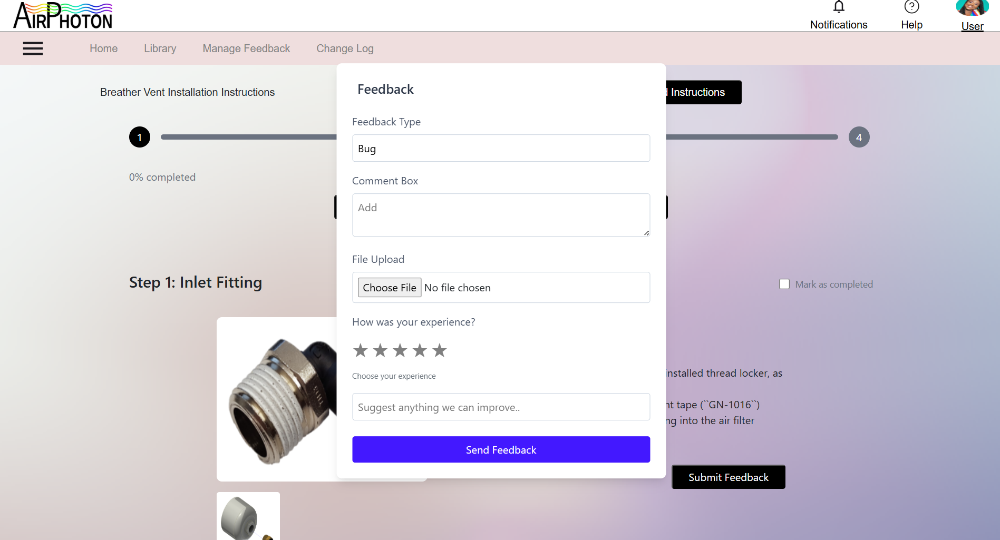
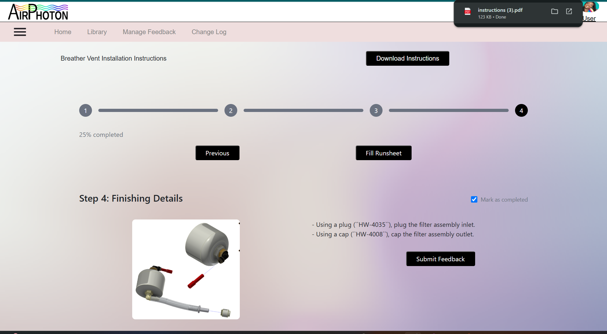
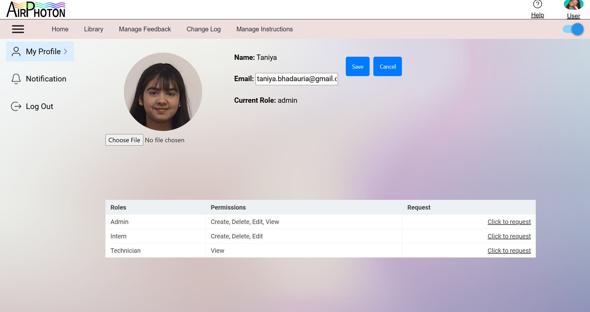
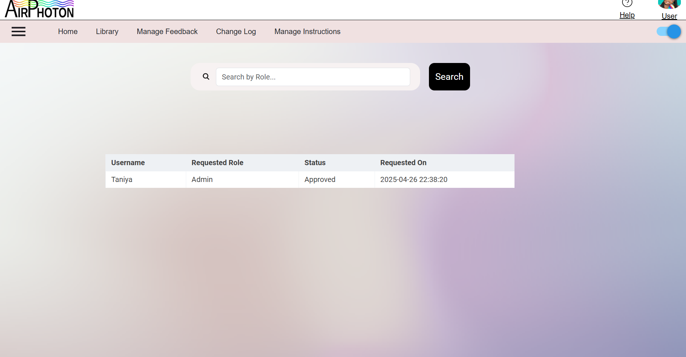
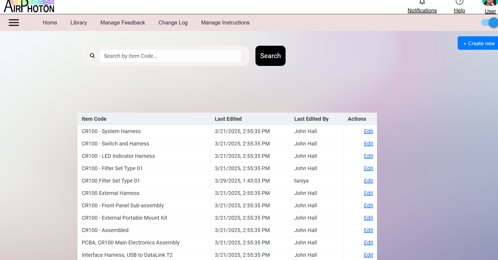
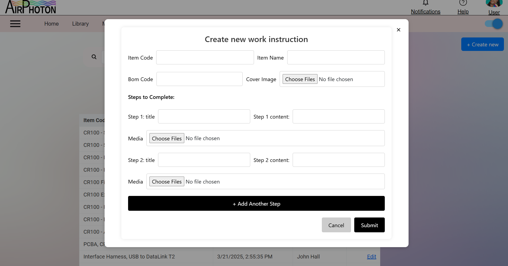
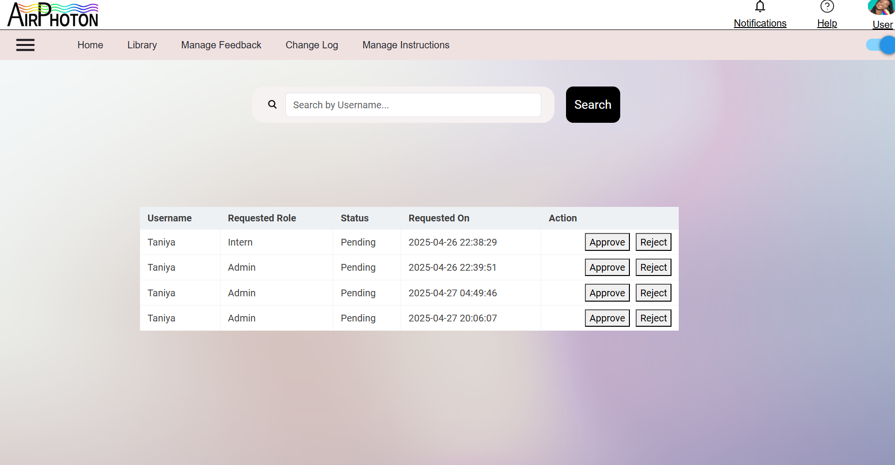
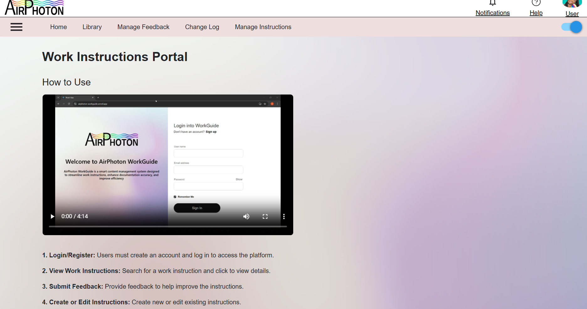
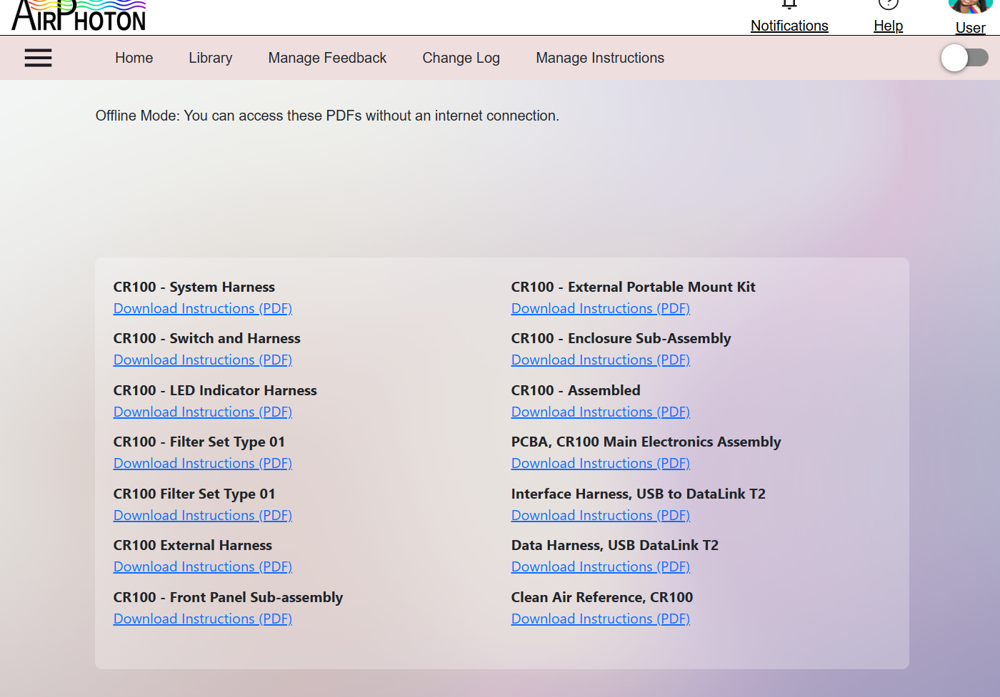

# Airphoton-Workguide
Smart content management system designed to streamline work instructions

Overview

This project consists of a server and a frontend application. The following guide explains how to build, run, and use the application effectively.

1. Frontend Setup

    Prerequisites
    
        Ensure you have the following installed:
        
        Node.js(v18)
        
        npm (v10 or later)
    
    Navigate to the frontend directory:

        cd workguide

   Install dependencies:
        
        npm install

   Start the backend server:

        npm start
   The API should now be running on http://localhost:3000

2. Backend Setup (Python API)

    Prerequisites
    
    Python 3.8+
    
    Virtual environment

   Install & Run API:

        cd server
        python -m venv venv  # Create a virtual environment
        source venv/bin/activate  # Activate environment (Linux/macOS)
        venv\Scripts\activate  # Activate environment (Windows)
        pip install -r requirements.txt  # Install dependencies
        python server.py  # Run the API
   
   The API should now be running on http://localhost:5000

3.How to Use

Login/Register: Users must create an account and log in to access the platform.

View Work Instructions: Search CR100 Filter Set Type 01 .

Click the item to view instructions.

Submit Feedback: Provide feedback on work instructions to help improve content.

Fill Structured Runsheet: Complete job documentation through a structured form.

Download Instructions:

Role Management: Users can request roles via their profile settings and edit profile.

Clicking on notifications will redirect to the page where users can check thier raised role requests

Manage Feedback: Admins can review and resolve the feebacks

Versions: Admins can compare the latest versions

Manage Instructions: Users can create or edit the work instructions.
Clicking edit will redirect to the git repository and clicking creating new instruction will create a new feature branch in git repository.

Notifications: Only Admin Roles will have access to approve/reject the role requests.

Help: Has some steps to how to use the website

Offline mode: Users will have access to the pdf if they loose internet access.

